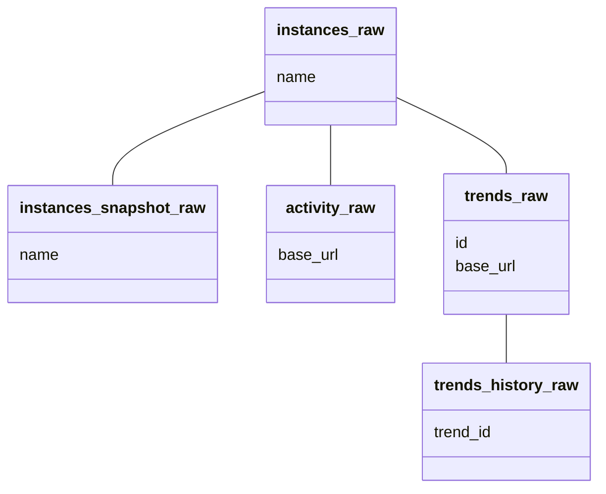

# MScraper Structure

## APIs

MScraper uses three APIs:

1. Instances.social
2. Mastodon API
3. FediDB (Not yet implemented)

### Instances.Social

The [instances.social](https://instances.social/api/doc/) provides a list of instances to query. An API token is required, but there is no rate limit.

### Mastodon API

MScraper uses the [public endpoints for the Mastodon API](https://docs.joinmastodon.org/client/public/), with the [Mastodon.py](https://github.com/halcy/Mastodon.py/tree/a4fff9f2602bc72da8d66de62b139934e5f13ac9) library providing a Python wrapper.

Each instance may have its own access requirements, but an API Key is generally not necessary for public endpoints.

Mscraper queries these endpoints:

- [Activity](https://docs.joinmastodon.org/methods/instance/#activity): Weekly statistics for the number of statuses, logins, and registratiosn
- [Trends](https://docs.joinmastodon.org/methods/trends/#statuses): Popular hashtags for each instance

### FediDB

FediDB provides information not available through individual instances' APIs, specifically server location, if available.

